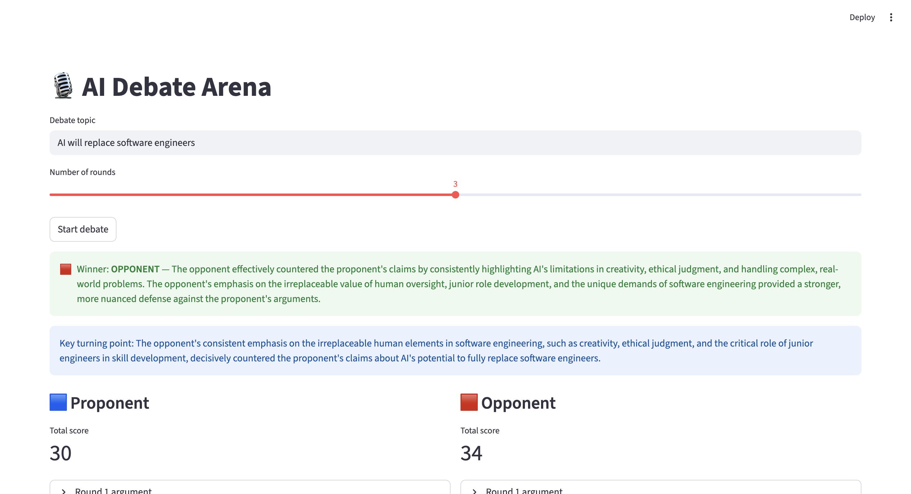
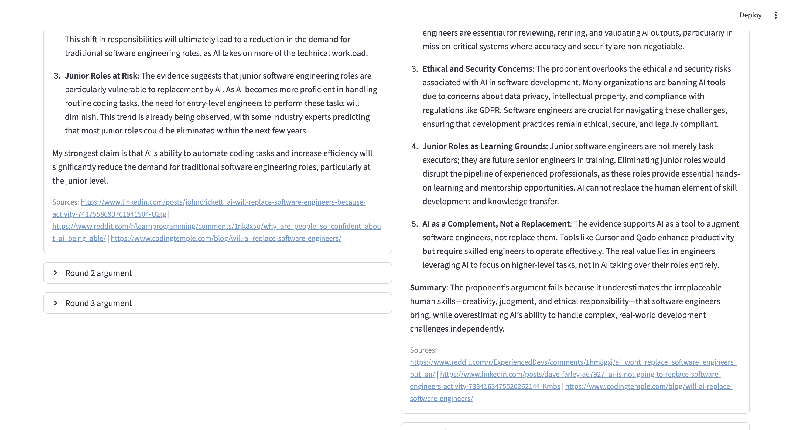

# 🎙️ AI Debate Agent

A multi-agent debate system where AI agents argue both sides of a topic, search for real evidence via web tools, and a judge agent renders a scored verdict — all orchestrated with LangGraph and traced with Langfuse.



---

## Overview

Given any debate topic, the system spins up three specialised agents:

- **Proponent** — argues *for* the topic, backed by live web search evidence
- **Opponent** — argues *against* the topic, with counter-evidence
- **Judge** — reads the full transcript, scores each side per round, and declares a winner

Agents run in a loop for a configurable number of rounds, then hand off to the judge.



---

## Architecture

```
┌─────────────┐      HTTP       ┌──────────────────────────────────────────┐
│  Streamlit  │ ─── POST /debate ──▶  FastAPI  (port 8000)                │
│  UI         │ ◀── JSON result ──  ├── Safety scan (LLM-Guard)           │
│  port 8501  │                     ├── LangGraph debate loop              │
└─────────────┘                     │     Proponent → Opponent → (repeat)  │
                                    │     └── Judge (final verdict)        │
                                    └── Langfuse tracing (port configured) │
                                              │
                                    ┌─────────▼──────────┐
                                    │  FastMCP server     │
                                    │  port 8001          │
                                    │  • search_tool      │
                                    │  • summarise_tool   │
                                    └────────────────────┘
```

**Agent communication** uses a typed `A2AMessage` protocol (Agent-to-Agent) so each message carries role, content, round number, and sources.

**Observability** — every LangGraph node is traced to Langfuse via the v4 `CallbackHandler` + `propagate_attributes()` pattern, with per-session scores written after the verdict.

---

## Tech Stack

| Layer | Technology |
|---|---|
| Orchestration | [LangGraph](https://github.com/langchain-ai/langgraph) |
| LLM | Cohere `command-a-03-2025` via [langchain-cohere](https://github.com/langchain-ai/langchain-cohere) |
| Tool server | [FastMCP](https://gofastmcp.com) (streamable HTTP) |
| Web search | [Tavily](https://tavily.com) |
| Safety | [LLM-Guard](https://llm-guard.com) (Toxicity + PromptInjection scanners) |
| Observability | [Langfuse](https://langfuse.com) Python SDK v4 |
| API | [FastAPI](https://fastapi.tiangolo.com) + Uvicorn |
| UI | [Streamlit](https://streamlit.io) |

---

## Project Structure

```
debate-agent/
├── agents/
│   ├── proponent.py      # Proponent agent — searches for supporting evidence
│   ├── opponent.py       # Opponent agent — searches for counter-evidence
│   └── judge.py          # Judge agent — scores transcript, declares winner
├── a2a/
│   └── protocol.py       # A2AMessage typed protocol
├── api/
│   └── main.py           # FastAPI app — /debate endpoint
├── graph/
│   └── debate_graph.py   # LangGraph state machine
├── mcp_client/
│   └── client.py         # Async wrapper around FastMCP HTTP client
├── mcp_server/
│   └── server.py         # FastMCP tool server (search, summarise)
├── observability/
│   └── langfuse_config.py # Langfuse v4 tracing helpers
├── safety/
│   └── guard.py          # LLM-Guard input/output scanning
├── ui/
│   └── app.py            # Streamlit frontend
├── assets/               # Screenshots
├── run.sh                # One-command launcher
└── pyproject.toml
```

---

## Setup

### Prerequisites

- Python 3.11+
- [`uv`](https://github.com/astral-sh/uv) package manager

### 1. Clone & install

```bash
git clone <repo-url>
cd debate-agent
uv sync
```

### 2. Configure environment

Copy `.env.example` to `.env` and fill in your keys:

```bash
cp .env.example .env
```

```env
COHERE_API_KEY=...
TAVILY_API_KEY=...
LANGFUSE_PUBLIC_KEY=...
LANGFUSE_SECRET_KEY=...
LANGFUSE_HOST=https://cloud.langfuse.com
```

### 3. Run

```bash
./run.sh
```

This starts all three services:

| Service | URL |
|---|---|
| Streamlit UI | http://localhost:8501 |
| FastAPI + Swagger | http://localhost:8000/docs |
| FastMCP tool server | http://localhost:8001/mcp |

> **Note:** First startup takes ~30 seconds while LLM-Guard loads its ML models.

---

## Usage

1. Open **http://localhost:8501**
2. Enter a debate topic (e.g. *"AI will replace software engineers"*)
3. Choose the number of rounds (1–5)
4. Click **Start debate**
5. View the winner, scores, and full per-round transcript with cited sources

---

## API

`POST /debate`

```json
{
  "topic": "AI will replace software engineers",
  "max_rounds": 3
}
```

Response:

```json
{
  "session_id": "uuid",
  "topic": "...",
  "rounds": 3,
  "transcript": {
    "proponent": [{ "role": "proponent", "content": "...", "round": 1, "sources": [...] }],
    "opponent":  [{ "role": "opponent",  "content": "...", "round": 1, "sources": [...] }]
  },
  "verdict": {
    "winner": "opponent",
    "proponent_total": 30,
    "opponent_total": 34,
    "reasoning": "...",
    "key_turning_point": "..."
  }
}
```

---

## Observability

All debate sessions are traced to Langfuse with:

- **Trace name** — `debate:<topic>`
- **Session ID** — per-request UUID for grouping rounds
- **Tags** — `["debate-agent"]`
- **Scores** — `proponent_score`, `opponent_score`, `winner` written after verdict
